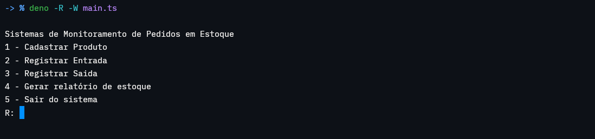

# SMPE - Sistema de Monitoramento de Pedidos em Estoque

## Descrição

Sistema de armazenamento de estoque utilizando Deno + Typescript com banco de dados SQLite. Ele funciona por CLI (Command Line Interface) do computador

- Exemplo

  

## Tecnologias

<div style="display: inline_block">
    <br>
    
    
    
</div>

## Como Instalar?

- Para rodar o código é necessário ter instalado SQLite no seu computador para iniciar o banco de dados, poís é possível iniciar o projeto com o executável do sistema sem a necessidade de instalar Deno
- Link para instalar SQLite: [Clique aqui](https://www.sqlite.org/download.html)

- Use o comando para instalar o projeto:
    ```sh
    git clone https://github.com/Sansao77/sistema_estoque.git
    ```

- Agora para configurar o banco de dados (SQLite), utilize o passo a passo:
    1. Criar a pasta /app/data e criar o arquivo estoque.db dentro
        - Para Linux/Mac
            ```sh
            mkdir -p ~/Downloads/sistema_estoque/app/data && touch ~/Downloads/sistema_estoque/app/data/estoque.db
            ```

        - Para Windows recomendo usar o gerenciador de pastas, criar a pasta e arquivo por ele

    2. Iniciar SQLite no arquivo estoque.db

        ```sh
        sqlite3 ~/Downloads/sistema_estoque/app/data/estoque.db
        ```

    3. Iniciar banco de dados no arquivo com o example_db.sql

        ```sh
        .read ~/Downloads/sistema_estoque/example_db.sql
        ```

    4. Sair do SQLite

        ```sh
        .quit
        ```

- O executável já pode ser inicializado em Windows ao clicar nele mas para utilizar em Linux é preciso permitir acesso de execução:
    ```sh
    chmod +x ~/Downloads/sistema_estoque/SMPE_backend.exe
    ```
